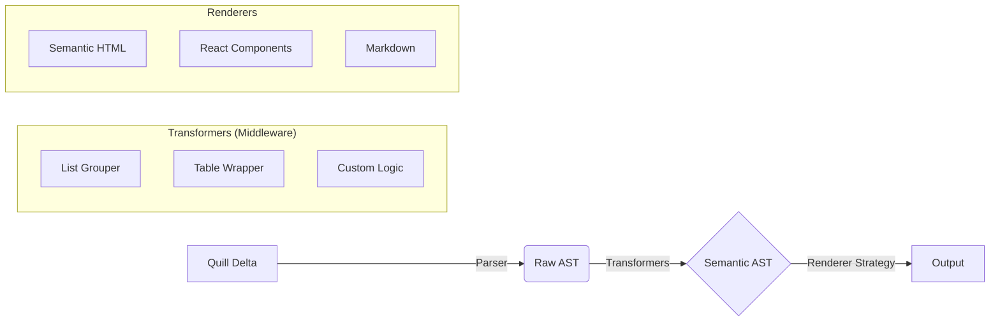

# quill-delta-render

A framework-agnostic, AST-based engine for converting Quill Deltas into HTML, Markdown, React components, or any other format.

## 1. Philosophy & Architecture

Unlike existing libraries that perform simple string concatenation or regex replacements, `quill-delta-render` treats content transformation as a three-stage pipeline. This ensures robustness, testability, and unlimited flexibility.

### The Pipeline



1. **Parsing:** Converts the flat Delta operations into a raw tree structure.
2. **Transformation:** Applies middleware to organize nodes (e.g., grouping `<li>` items into `<ul>`, wrapping tables).
3. **Rendering:** Traversing the final AST and applying a specific Strategy (HTML string, React Virtual DOM, etc.) to generate the output.

---

## 2. Core Concepts

### The AST Node

The library operates on a universal **Abstract Syntax Tree**. This decouples the input (Quill) from the output (HTML/React).

```typescript
interface TNode {
  type: string; // e.g., 'paragraph', 'list', 'video'
  attributes: Attributes; // e.g., { align: 'center', id: '123' }
  children: TNode[]; // Nested nodes
  data?: any; // Text content or embed payload
  isInline: boolean; // Helper for rendering logic
}
```

### The Renderer Strategy

A Renderer is a generic class responsible for converting Nodes into a specific `Output` type (`string`, `ReactNode`, `JSON`).

```typescript
interface RendererConfig<Output> {
  // How to render blocks (p, h1, div)
  blocks: Record<string, BlockHandler<Output>>;
  // How to render inline styles (bold, link), sorted by priority
  marks: Record<string, MarkHandler<Output>>;
}
```

---

## 3. Implementation Guide

### Directory Structure

Recommended structure to maintain separation of concerns:

```text
src/
├── core/
│   ├── parser.ts          // Delta -> Raw AST
│   ├── ast-types.ts       // TypeScript Interfaces
│   ├── transformer.ts     // Middleware runner
│   └── base-renderer.ts   // Abstract class handling recursion & priorities
├── common/
│   └── transformers/      // Reusable logic
│       ├── list-grouper.ts
│       └── table-grouper.ts
├── renderers/
│   ├── html/
│   │   ├── semantic.ts    // Clean HTML
│   │   └── quill.ts       // Quill-compatible HTML (classes)
│   ├── react/
│   │   └── react-renderer.ts
│   └── markdown/
│       └── markdown-renderer.ts
└── index.ts

```

---

## 4. Usage Examples

### A. Basic Usage (Semantic HTML)

For backend usage (Node.js) or simple text display.

```typescript
import { DeltaParser, SemanticHtmlRenderer } from 'quill-delta-render';
import { ListGrouper } from 'quill-delta-render/common';

const delta = {
  ops: [{ insert: 'Hello' }, { insert: '\n', attributes: { header: 1 } }],
};

// 1. Parse & Transform
const ast = new DeltaParser(delta)
  .use(ListGrouper) // Automatically groups <li> into <ul>/<ol>
  .toAST();

// 2. Render
const renderer = new SemanticHtmlRenderer();
const html = renderer.render(ast);

console.log(html);
// Output: <h1>Hello</h1>
```

### B. React Component (No `dangerouslySetInnerHTML`)

Secure rendering for SPA.

```typescript
import { ReactRenderer } from 'quill-delta-render/react';

const MyPost = ({ content }) => {
  const renderer = new ReactRenderer();

  // renderer.render returns an array of React Elements, not a string
  return <div className="post-content">{renderer.render(content)}</div>;
};
```

### C. Customizing Output (The "Overrides")

You can extend any renderer or override specific configurations.

```typescript
import { SemanticHtmlRenderer } from 'quill-delta-render';

const myRenderer = new SemanticHtmlRenderer();

// Override 1: Render images with Lazy Loading and a wrapper
myRenderer.extendBlock('image', (node) => {
  return `
    <figure class="custom-image">
      
      <figcaption>${node.attributes.caption}</figcaption>
    </figure>
  `;
});

// Override 2: Change how mentions are rendered
myRenderer.extendMark('mention', (content, userId) => {
  return `<a href="/profile/${userId}" class="user-link">@${content}</a>`;
});
```

---

## 5. Advanced Configuration

### Mark Priorities

One of the hardest problems in rich text is nesting order.
Example: `<a href...><span style="color:red"><b>Text</b></span></a>` vs `<b><a ...>...</a></b>`.

This library solves it via **Mark Priorities**.

```typescript
// Default Configuration internally
export const MARK_PRIORITIES = {
  link: 100, // Highest: Wraps everything
  background: 50,
  color: 40,
  bold: 10,
  italic: 10,
  script: 5, // Lowest: Closest to the text
};
```

_When implementing `BaseRenderer`, ensure attributes are sorted by these values before rendering._

### Transformations (Middleware)

Sometimes the structure needs to change _before_ rendering.

**Example: `ListGrouper**`Quill Deltas store lists as flat lines. The`ListGrouper` transformer:

1. Scans the AST.
2. Detects adjacent `list-item` nodes.
3. Wraps them in a `list` container node.
4. Nests them correctly based on indentation levels.

```typescript
// Custom Transformer Example: Wrap all images in a gallery div
const GalleryGrouper = (root: TNode): TNode => {
  // Logic to find adjacent images and group them
  return newRoot;
};

parser.use(GalleryGrouper);
```

---

## 6. Developing a New Renderer

To support a new format (e.g., PDFMake, Vue), extend the `BaseRenderer`.

```typescript
import { BaseRenderer, TNode } from 'quill-delta-render/core';

// T = The output type of your renderer
export class MarkdownRenderer extends BaseRenderer<string> {
  constructor() {
    super({
      blocks: {
        header: (node, children) => {
          const prefix = '#'.repeat(node.attributes.header);
          return `${prefix} ${children}\n\n`;
        },
        paragraph: (node, children) => `${children}\n\n`,
        // ...
      },
      marks: {
        bold: (content) => `**${content}**`,
        italic: (content) => `_${content}_`,
        link: (content, href) => `[${content}](${href})`,
      },
    });
  }

  // Abstract method implementation
  protected convertString(str: string): string {
    return str; // No escaping needed for simple MD, or add logic here
  }
}
```

## 7. Comparison with `quill-delta-to-html`

| Feature          | `quill-delta-to-html`     | `quill-delta-render`                       |
| ---------------- | ------------------------- | ------------------------------------------ |
| **Architecture** | String Concatenation      | AST + Visitor Pattern                      |
| **Flexibility**  | Limited (Config objects)  | Infinite (Custom Renderers & Transformers) |
| **Output**       | HTML only                 | HTML, React, Markdown, JSON, PDF           |
| **Security**     | `dangerouslySetInnerHTML` | Native React Components supported          |
| **Logic**        | Hardcoded                 | Modular (Middleware)                       |
| **Environment**  | Browser/Node              | Browser/Node (No DOM dependency)           |

---
